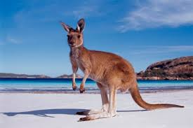

# Latihan1
<!DOCTYPE html>
<html lang="en">
<head>
    <meta charset="UTF-8">
    <meta name="viewport" content="width=device-width, initial-scale=1.0">
    <title>Tugas 1 HTML Dasar</title>
</head>
<body>
    <h1>Kebun Binatang Suka Ria</h1>
    <h2>Semua Makhluk Harus Disayang</h2>
    <h3>Berbagai Macam Hewan di Kebun Binatang Suka Ria</h3>
    <h4>Kangguru</h4>
    

    Kanguru adalah hewan berkantung dari keluarga Macropodidae. Dalam penggunaan umum istilah ini digunakan untuk menggambarkan spesies terbesar dari keluarga ini, kanguru merah, serta kanguru antilopine, kanguru kelabu timur, dan kanguru kelabu barat. Kanguru berasal dari Australia dan Papua.
    <h4>Red Panda</h4>
    

    Panda merah, yang tumbuh sebesar kucing rumahan, adalah hewan akrobat mengesankan yang memanjat dan berayun di pohon di hutan tempat tinggal mereka di Asia, dan mereka pernah memicu perdebatan sengit tentang hubungan mereka dengan panda raksasa. Para ahli taksonomi sebelumnya menggolongkan mereka ke dalam keluarga rakun dan keluarga beruang, namun penelitian DNA kemudian mengungkapkan bahwa mereka termasuk dalam keluarga unik mereka sendiri (Ailuridae) dan genus (Ailurus).

</body>
</html>
